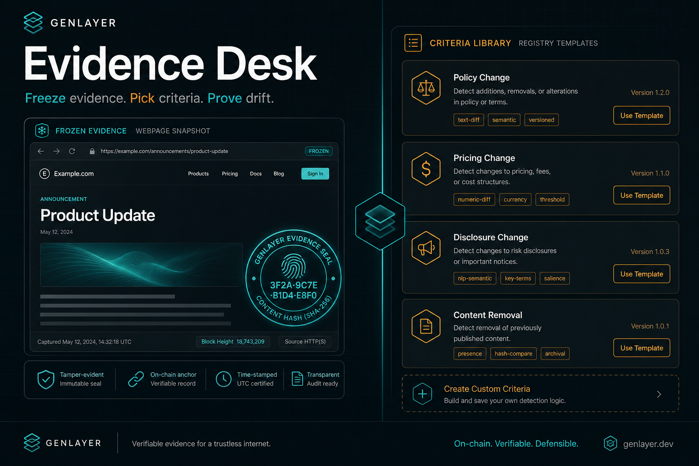

# Evidence Desk

<p align="center">
  
</p>

<p align="center">
  <strong>GenLayer dispute evidence console — freeze evidence, pick criteria, prove drift.</strong>
</p>

<p align="center">
  <a href="https://evidence-desk-chi.valandelon.com"></a>
  <a href="https://docs.genlayer.com/"></a>
  <a href="https://github.com/valentinzubok/EvidenceSnapshot"></a>
  <a href="https://github.com/valentinzubok/PromptRegistry"></a>
</p>

---

## What it is

**Evidence Desk** is a Next.js dApp that unifies two GenLayer primitives into one product workflow:

| Primitive | Role in app |
|-----------|-------------|
| [EvidenceSnapshot](https://github.com/valentinzubok/EvidenceSnapshot) | Open cases, view frozen hashes, run cross_check |
| [PromptRegistry](https://github.com/valentinzubok/PromptRegistry) | Browse top criteria templates, copy get_body text |

GenLayer is central: all reads/writes go through **genlayer-js** on **Studionet** with MetaMask.

**Live demo (read-only works without wallet):** https://evidence-desk-chi.valandelon.com

---

## Features

- **Cases** — list_cases, get_case, open_case, cross_check (wallet)
- **Criteria** — top templates with card previews, get_body, copy to clipboard
- **Wallet** — MetaMask connect + Studionet via `client.connect()`
- **Recent & favorites** — local history for quick case navigation
- **i18n** — English / Russian UI toggle
- **Explorer links** — Studionet contract pages

---

## Prerequisites

- **Node.js** ≥ 18
- **npm** ≥ 9
- **git**
- **MetaMask** (only for write transactions: `open_case`, `cross_check`)
- Optional: [GenLayer CLI](https://docs.genlayer.com/) if you deploy your own contracts

---

## Run locally

```bash
git clone https://github.com/valentinzubok/EvidenceDesk.git
cd EvidenceDesk
npm install
cp .env.example .env.local   # optional — defaults to Studionet addresses
npm run dev
```

Expected output:

```text
▲ Next.js 16.x
- Local:   http://localhost:3000
✓ Ready
```

Open http://localhost:3000

1. Browse **Cases** / **Criteria** without wallet (read-only)
2. Click **Connect Wallet** for transactions
3. Toggle **EN / RU** in the header

### Environment variables

| Variable | Description | Default (Studionet) |
|----------|-------------|---------------------|
| `NEXT_PUBLIC_SNAPSHOT_ADDRESS` | EvidenceSnapshot contract | `0x356C…721a` |
| `NEXT_PUBLIC_REGISTRY_ADDRESS` | PromptRegistry contract | `0xc62e…4DF3` |

Copy from `.env.example`:

```bash
cp .env.example .env.local
```

---

## UI preview

<p align="center">
  
</p>

Screens: **Home** → workflow overview · **Cases** → open_case / cross_check · **Criteria** → template cards + copy

---

## Tests

```bash
npm test          # vitest — JSON parsing, markdown preview, error helpers
npm run lint
npm run build
```

Contract integration tests require Studionet RPC; UI E2E with Cypress can be added for MetaMask flows.

---

## Deploy (Vercel)

```bash
npm run build
vercel deploy --prod
```

Set env vars from `.env.example` in Vercel project settings.

Production: https://evidence-desk-chi.valandelon.com

---

## Contract addresses (Studionet)

| Contract | Address |
|----------|---------|
| EvidenceSnapshot | `0x356C408058cb82934eE6f62B14FC85D52858721a` |
| PromptRegistry | `0xc62eC7D0133867b33f50D7E9416D01A8Cc244DF3` |

---

## Stack

- Next.js 16 (App Router) + TypeScript + Tailwind
- [genlayer-js](https://github.com/genlayerlabs/genlayer-js) (Studionet)
- MetaMask (`window.ethereum`)
- Vitest for unit tests
- CSP + security headers in `next.config.ts`

---

## Portal

Submit under **Projects** — see [SUBMIT.md](SUBMIT.md).

---

## License

MIT © Valentyn Zubok
